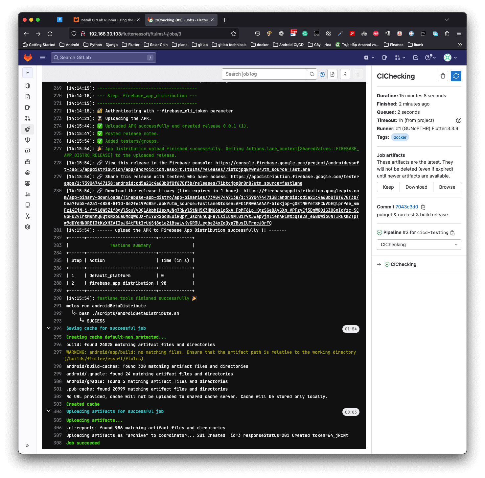

# GetX_Sample
A Flutter project base on [GetX][1].

## I. Introduction
This project is a sample project building to adapt to a full software development life cycle including Tasks Estimation, Codebase Creation, Source Code Management using Git Flow,
Testing(unit tests, integration tests), Continuous Integration, Continuous Delivery, and
Continuous Deployment.
<br />
## II. Installation
### 1. Install the Flutter SDK.
You can follow the steps from the [Flutter official web page](17).
### 2. Active the Melos package.
You can install this package after the Flutter SDK installing with this command:<br />

```shell
dart pub global activate melos
```

Or you can view the [Melos package homepage](18) for more details.
### 3. Install necessary tools.
After performing 2 steps above, you can install other necessary tools by running Melos's command following below:

```shell
melos installTools
```

<mark> **Note**: You need to pay attention to the installation process to grant root permission for some necessary settings.<br /><mark />

This Melos's script will install FVM for you too so you can skip the fourth step below.
However, you still need to active FVM for this project following the below command:

```shell
melos fvmUse
```

### 4. Install the Flutter Version Manager(FVM).
Flutter version management is a big trouble that any Flutter developers have to face in their development process.
So, in this project, I have used the FVM([Flutter Version Management][2]) package to manage it easily, rapidly, and conveniently.

To install this app, you can see at FVM official [page][3].
Here, I only show you some steps to run this sample.

1. Flutter version 3.7.12 is used for this project:
```
fvm use 3.7.12
```

2. FVM setup for the Android Studio:
<p align='center'>
    
</p>

3. FVM setup for the VSCode:
   Create a settings.json file on ~/.vscode folder and paste content below:
```
{
  "dart.flutterSdkPath": ".fvm/flutter_sdk",
  // Remove .fvm files from search
  "search.exclude": {
    "**/.fvm": true
  },
  // Remove from file watching
  "files.watcherExclude": {
    "**/.fvm": true
  },
  "terminal.integrated.fontFamily": "MesloLGS NF",
}
```
=> You can also add this settings to the user settings or workspace settings for your VSCode.
<br />

## III. Libraries Used

* Third party
    * [GetX][1] fast, stable, extra-light and powerful Flutter framework.
    * [Get_CLI][14] is a CLI tool used to help build your App's features with GetX more easily.
    * [Melos][13] is a CLI tool used to help manage Dart projects with multiple modules/packages and more ….
    * [Flutter_Gen][15]: The Flutter code generator for your assets, fonts, colors, ….
    * [Theme Tailor][16]: The code generator and theming utility for supercharging Flutter ThemeExtension classes.

## IV. How to use?
### 1. Create a new feature.
This project is built based on the GetX framework, so to build your App's features faster and easier I have integrated the [Get_CLI][14].<br />
To create a new feature, such as login, you only have to run:
```dart
get create page:login
```
After the command is run, a page has a username created that included view, controller, and binding.
View, Controller, and Binding have generated automatically and then are added to the corresponding places(app_pages, app_routes) so you can manage them easily.

Now you can use the greate features that GetX brings.

#### 1.1. Navigation
* To navigate to nextScreen
```dart
Get.toNamed(Routes.LOGIN);
```
* To navigate and remove the previous screen from the tree.

```dart
Get.offNamed(Routes.LOGIN);
```

* To navigate and remove all previous screens from the tree.

```dart
Get.offAllNamed(Routes.LOGIN);
```

Moreover, GetX Navigation mechanism also offers some other features such as:

* Navigation with Dynamic Urls Link:

```dart
// navigate to profile with the id is 34954
Get.offAllNamed("/profile/34954");
// navigate with some params
Get.toNamed("/profile/34954?flag=true&country=italy");
```

* listen GetX Navigation Events to trigger actions with Middleware
* ...

#### 1.2. Dependency Injection

* Providers and Consumners. <br />

Get has a simple and powerful dependency manager that allows you to retrieve the same class as your Bloc or Controller with just 1 lines of code, no Provider context, no inheritedWidget:

```dart
// To provide a controller/bloc in a binding
Controller controller = Get.put(Controller());

// To use it in a view, or another object.
final controller = Get.find<Controller>();
// or
Controller controller = Get.find();
```

* Bindings<br />

<mark> **Note**: One of the most differentials of GetX Dependency Injection package is the possibility of full integration of the routes, state manager and dependency manager.<br />
When a route is removed from the Stack, all controllers, variables, and instances of objects related to it are removed from memory.<br /><mark />

Additionally, GetX also offers a lot of methods for providers such as: Get.put(), Get.lazyPut(), Get.putAsync(), Get.create(),... and a smart management mechanism to prevent memory leaks. You can see more detail in the official documents [here][19].

#### 1.3. State Management.
State management is also one of the main components within a code base as well as a framework.
Therefore, GetX has provided a great mechanism to manage states of view. For more detail you should see [here][20].

<mark> ***Note***: Flutter has a lot of packages for the State Management so there is a lot of controversy about which tool we should use.
Personally, I think we don't have a perfect tool. It is important that you have to understand and have to use it correctly.
<mark />

### 2. Manage resources.
I have added the Flutter Gen package to manage and share resources so all resources now we can manage and use easily.
For more detail, you can see in the official [page][14].

Now, you can use, reuse, share, modify, and manage single or multiple resources such as(animations(flare, lottie), vector/raster images, colors, fonts,...) at once.

```dart
// user colors from resources.
LMSColors.mainGreen;
// user vector image from resources.
Assets.images.icSparkles.svg(width: 13, fit: BoxFit.cover).
// user raster image from resources.
Assets.images.profile.image();
// load json from assets.
final json = await rootBundle.loadString(Assets.json.fruits);
// more and more...
```

### 3. Manage tasks & modules with [Melos][13].
In the process of the Flutter Application Development, we often have to run many long/confusing/boring bash/shell commands.
It takes a lot of time and effort, especially when you have to do it on many different modules/packages.
That's why the Melos was born.

You can define/combine a long command or multiple commands by a task with a meaningful name and then use it with any tools(Android Studio, VSCode, Docker,...).

This is some examples:

```shell
# You can use:
melos installTools
# replaced for multiple commands:
# 1. install the FVM and use a Flutter SDK.
brew tap leoafarias/fvm
brew install fvm
fvm install 3.7.12
fvm use 3.7.12
# 2. install flutter_gen
dart pub global activate flutter_gen
# 3. install get_cli
dart pub global activate get_cli
# 4. install lcov to convert the lcov.info file to HTML pages.
brew install lcov
# 5. install cloc to tracking file types.
brew install cloc
```

Replace a long command with muiltple confusing parameters:

```shell
git ls-files -z -- '*.dart' | xargs -0 dart format "$@" -l 99

fvm flutter build appbundle --obfuscate --split-debug-info --split-per-abi \
--dart-define=DART_DEFINES_APP_NAME="GetXSample" \
--dart-define=DART_DEFINES_BASE_URL="https://danhdue.com/api/v1" \
--release \
--verbose
```

with:
```dart
melos buildAppBundleRelease
```

### 4. Manage styles & themes.
One of the tasks that take much time and effort is UI editing.
If you don't have a mechanism to manage styles and colors for texts and other UI components, you will have big trouble whenever you need to edit or change them.
Especially, when you have multiple themes and want to change a theme at runtime.

In this project, I have added the [Theme Tailor][16] to handle all mentioned issues.

You can see it in this class:

```dart
@Tailor(
  themes: ['light', 'dark'],
  themeGetter: ThemeGetter.onBuildContext,
)
class $_ThemeExtensions {
  static List<Color> background = [LMSColors.black, LMSColors.white];

  static const headLineTextStyle = TextStyle(
      fontSize: 30,
      fontFamily: LMSFontFamily.sfCompactSemiBold,
      fontWeight: FontWeight.w700,
      height: 1.6,
      letterSpacing: 1.2,
      decoration: TextDecoration.none);

  static List<TextStyle> headline = [headLineTextStyle, headLineTextStyle];

  static const h1TextStyle = TextStyle(
      fontSize: 24,
      fontFamily: LMSFontFamily.sfCompactSemiBold,
      fontWeight: FontWeight.w700,
      height: 1.3,
      letterSpacing: 1.2,
      decoration: TextDecoration.none);

  static List<TextStyle> heading1 = [h1TextStyle, h1TextStyle];
}
```

And then you can use it through an extension function:

```dart
extension ThemeExtensionsBuildContext on BuildContext {
  ThemeExtensions get themeExtensions => Theme.of(this).extension<ThemeExtensions>()!;
}
```

an example:

```dart
AutoSizeText(
  'Poi',
  style: context.themeExtensions.heading2
      .copyWith(color: context.themeExtensions.red),
);

Assets.images.trafficOff
  .image(width: 46, height: 46,
   fit: BoxFit.cover, color: context.themeExtensions.dartmouthGreen);
```


### 5. integrate CI/CD.
In this project, I have installed the [Fastlane][21], [Melos][13] and some other tools on a [Docker][22] image to adapt to almost the CI/CD system that supported Docker such as [Github Actions][23], [Gitlab CI][24], [Circle CI][25],....

After the code convention checking, unit testing, and building,... all the results will be saved and deployed to Firebase App Distribution/App Stores(Google Play, Apple Store) for the mobile apps or the Github/Gitlab Pages for the Flutter Web app.

So, the coordination between departments in product development will become easier, prevent and minimize impacts and conflicts. 

## V. CI/CD results with Gitlab, Gitlab Runner, Docker,... on another project.
### 1. Flutter project overview.


### 2. Results ran on Virtual Box's Ubuntu Server.
<b>Setup environment and restore cached files</b>

<b>Distribute to Firebase and save cached files.</b>

## Screenshots
1. Coverage Overview.


2. Unit Test overview for a controller.


3. Unit Test Detail for a controller.


<br />

## References

* [New Setup for Flutter Stacked State Management.][4]
* [Flutter StateManagement with Stacked - Deep Dive tutorial.][5]
* [Bottom Navigation with Stacked Architecture.][6]
* [Handle Users profile in Flutter.][7]
* [How to Unit Test in Flutter.][8]
* [Flutter 1.17 — no more Flavors, no more iOS Schemas. Command argument that changes everything.][9]
* [Setup development environments(Develop/Staging/Production) for the Flutter Project.][10]
* [How to Parse JSON in Dart/Flutter with Code Generation using Freezed.][11]
* [The Network Module for the Flutter using Dio, Freezed, json_annotation, json_serializable.][12]

<br />

[0]: https://flutter.dev/
[1]: https://github.com/jonataslaw/getx#about-get
[2]: https://fvm.app/
[3]: https://fvm.app/docs/getting_started/installation
[4]: https://viblo.asia/p/new-setup-for-flutter-stacked-state-management-ByEZkejA5Q0
[5]: https://viblo.asia/p/flutter-statemanagement-with-stacked-deep-dive-tutorial-GrLZDBRg5k0
[6]: https://viblo.asia/p/bottom-navigation-with-stacked-architecture-XL6lABVp5ek
[7]: https://viblo.asia/p/handle-users-profile-in-flutter-XL6lABpJ5ek
[8]: https://viblo.asia/p/how-to-unit-test-in-flutter-Eb85ozv6l2G
[9]: https://viblo.asia/p/flutter-117-no-more-flavors-no-more-ios-schemas-command-argument-that-changes-everything-3P0lPB7gKox
[10]: https://viblo.asia/p/setup-development-environmentsdevelopstagingproduction-for-the-flutter-project-bJzKmd9659N
[11]: https://viblo.asia/p/how-to-parse-json-in-dartflutter-with-code-generation-using-freezed-3Q75wv02lWb
[12]: https://viblo.asia/p/the-network-module-for-the-flutter-using-dio-freezed-json-annotation-json-serializable-bJzKmADrK9N
[13]: https://melos.invertase.dev
[14]: https://pub.dev/packages/get_cli
[15]: https://pub.dev/packages/flutter_gen
[16]: https://pub.dev/packages/theme_tailor
[17]: https://docs.flutter.dev/get-started/install
[18]: https://pub.dev/packages/melos/install
[19]: https://github.com/jonataslaw/getx/blob/master/documentation/en_US/dependency_management.md
[20]: https://github.com/jonataslaw/getx/blob/master/documentation/en_US/state_management.md
[21]: https://fastlane.tools/
[22]: https://www.docker.com/
[23]: https://github.com/features/actions
[24]: https://docs.gitlab.com/ee/ci/
[25]: https://circleci.com/

<br />

## License

Copyright 2022 DanhDue ExOICTIF, danhdue@gmail.com

Licensed to the Apache Software Foundation (ASF) under one or more contributor
license agreements.  See the NOTICE file distributed with this work for
additional information regarding copyright ownership.  The ASF licenses this
file to you under the Apache License, Version 2.0 (the "License"); you may not
use this file except in compliance with the License.  You may obtain a copy of
the License at

http://www.apache.org/licenses/LICENSE-2.0

Unless required by applicable law or agreed to in writing, software
distributed under the License is distributed on an "AS IS" BASIS, WITHOUT
WARRANTIES OR CONDITIONS OF ANY KIND, either express or implied.  See the
License for the specific language governing permissions and limitations under
the License.
